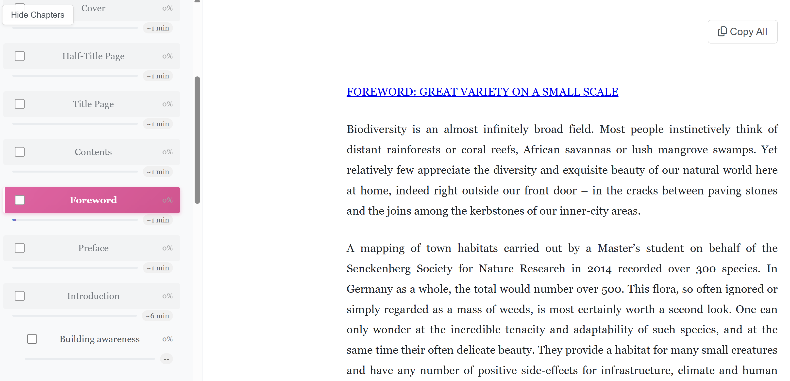

# Reader3

A lightweight, self-hosted EPUB & PDF reader for reading books alongside LLMs.



## Quick Start

```bash
# Install dependencies
uv sync

# Run the app
uv run python launcher.py
```

The browser opens automatically. Upload a book and start reading!

## Keyboard Shortcuts

| Shortcut | Action |
|----------|--------|
| `Ctrl/⌘+F` | Search |
| `Ctrl/⌘+B` | Bookmarks panel |
| `Escape` | Close modals |

## Building Executable

```bash
uv run python build_executable.py
```

Creates `dist/Reader3.app` (macOS) or `dist/Reader3.exe` (Windows).

## License

MIT
